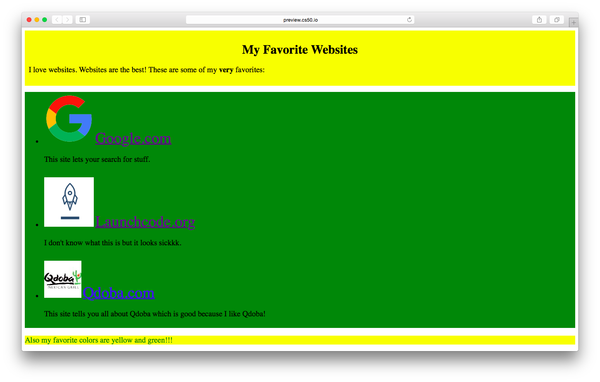

##### Module 6

[Back to Class 2 Prep](../class2-prep)

# Exercise: Stylish Favorite Websites

Remember that HTML page we made earlier, with our 3 favorites websites? We went ahead and spruced it up with some styling:

Gorgeous, right?

See if you can recreate these styles.

Our new [favorites.html](./favorites.html) links to a stylesheet called [styles.css](./styles.html). You should put all your styles in here. We've already gotten started for you with a few of them.
