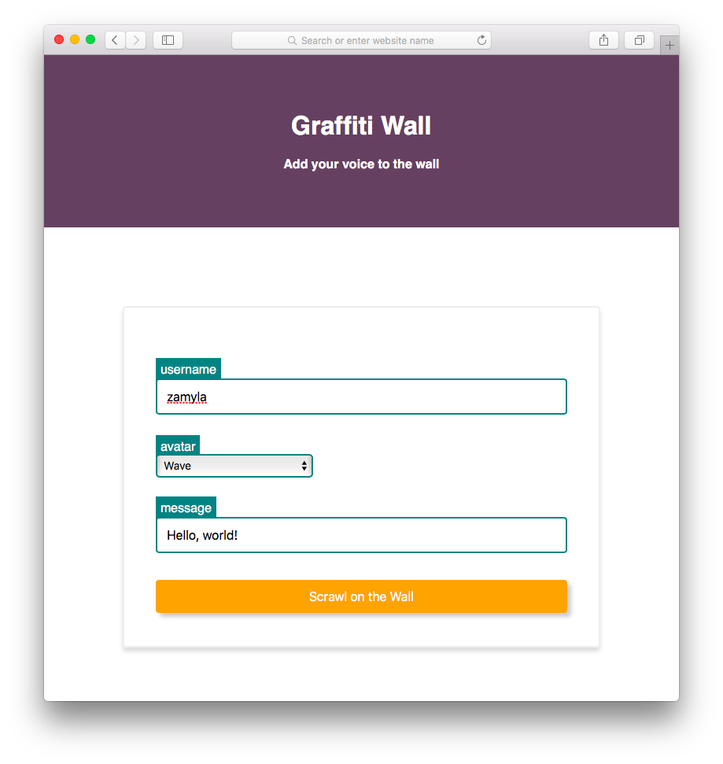
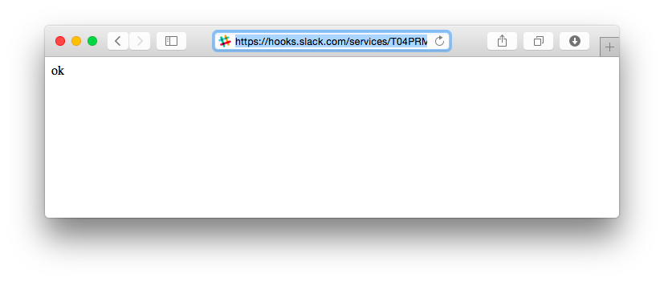
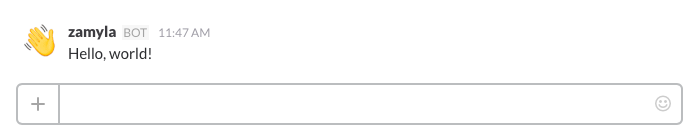
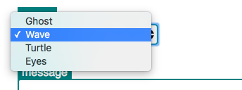

##### [Module 6](../../../)

# Problem Set: Graffiti

This problem set is going to be very similar to the [LunchCode](../../studios/lunchcode) studio. You will create an HTML page with a form that allows the user to interact with an API.

This time we will use the API to <a href="https://slack.com" target="_blank">Slack</a>, a chatroom service. Your page will enable users to post messages to a group conversation.

### Slack

Slack, if you're not familiar, is a chatroom service designed for teams of people to communicate on group projects. 

The easiest way to see is to check it out! We have a slack team called `LaunchCode Community` which, if you haven't already, you should totally join! <a href="https://launchcode-community.herokuapp.com" target="_blank">Click here</a> to get an invite.

Once you have created an account and signed in, you should see a chatroom with some messages posted, and a box at the bottom to post your own message. You've been dropped into the `#general` channel, but there are other channels for more specific topics (each channel is its own chatroom). Click the `Channels` link in the left-hand menu to see a list of all of our team's channels. Scroll down and click the `#cs50-general` channel (or just <a href="https://launchcodecommunity.slack.com/messages/cs50-general/" target="_blank">click here</a> if you got lost there). In this channel you'll find friendly folks talking about CS50x and helping each other, lovely stuff like that. Click the `Join Channel` button. Now you can post here too. If you're feeling not-shy, go ahead and say hello!

### Graffiti

Slack has a vast API for doing all kinds of fancy cool stuff. We're going to use one particular feature, their <a href="https://api.slack.com/incoming-webhooks" target="_blank">Incoming Web Hooks</a> endpoint, which simply allows an external program to post messages to a channel. For example, participants in a `#civic-hacking` channel might write a program that automatically posts updates of local elections around the country as the results come in.

Go take a look at the <a href="https://launchcodecommunity.slack.com/messages/pset-graffitiwall/" target="_blank">#pset-graffitiwall</a> channel, which we have set up specifically for the assignment. This channel will serve as a big shared "graffiti wall" on which you and hundreds of other CS50xers will come together and share pearls of wisdom such as:

* "Testing 123..."
* "asdf"
* "malan wuz hear"
* "Why is this not working?"
* "omg it actually worked jk lol"
* "malan rulez!"

It's gonna be wild.

### The Slack API

Let's take a few minutes to get comfortable with this API. 

First, quickly read through the <a href="https://api.slack.com/incoming-webhooks" target="_blank">Incoming Web Hooks</a> documentation page.

Remember the basic ingredients we need in order to send an HTTP request: the host server, the endpoint on that host, the type of HTTP method we want to use (GET or POST), and any additional data we need to send.

According to the Slack docs, the host that we want to talk to is `https://hooks.slack.com`

The endpoint is `/services/123456789`

where `123456789` represents a unique identifier to our `#pset-graffitiwall` channel. The actual channel ID is available on Vocareum. Click on the assignment titled **Problem Set: Graffiti**, and you will see it.

The overall url we want is simply the endpoint tacked onto the host: `https://hooks.slack.com/services/123456789`

Let's open up a terminal window and try to connect to this url. The following command

`curl https://hooks.slack.com/services/123456789`

is a start, but there are a few things missing. 

First, Slack specifies that they want an HTTP POST request, not a GET (which is what cURL uses by default). Let's specify that we want to make a POST request. We do this using the `-X` flag:

```nohighlight
$ curl -X POST https://hooks.slack.com/services/123456789
```

If you run that command, you should get a response of `no payload received`. We're getting closer. the problem now is that Slack is telling us that we didn't give it the information it needs: namely, if we're trying to post something to a channel, we must specify the contents of our message. The name of this field is `"text"`, and we provide a string value as our message. A natural first attempt would be to do something like this:

```nohighlight
$ curl -X POST https://hooks.slack.com/services/123456789?text=hello
```

But this will result in the same bitter rejection again: "no payload received". What's going on? It turns out that Slack wants this additional data in the form of a JSON string, rather than a normal field appended to a request. Recall that JSON is just a format for representing key/value pairs of information using `{` curly braces `}` and colons `:`, like this:

```nohighlight
{ 
    "name": "Harold",
    "icecream": "strawberry",
    "anotherKey": "anotherValue"
}
```

In our case we just have one piece of data:

```nohighlight
{ 
    "text": "hello"
}
```

which can be consdensed into 

```nohighlight
{ "text": "hello" }
```

because JSON does not require the whtiespace.

Slack wants this JSON to be the value associated with the key name "payload", so how about this?

```nohighlight
$ curl -X POST https://hooks.slack.com/services/123456789?payload={"text": "hello"}
```

Almost there! The above attempt results in a response like:

```nohighlight
curl: (3) [globbing] unmatched brace in column 87
curl: (3) [globbing] unmatched close brace/bracket in column 6
```

The problem is that there are certain characters, such as `{`, that you can't put directly inside a url. But `curl` gives us another avenue for attaching data to an HTTP request, the `--data` flag:

```nohighlight
$ curl -X POST --data 'payload={"text": "hello"}' https://hooks.slack.com/services/123456789
```

Notice that we must wrap the `'payload={"text": "hello"}'` portion in `'`single quotes`'`.

This command should receive a response of

```nohighlight
ok
```

Hey, that sounds pretty ok! And indeed, if you go over to the `#pset-graffitiwall` channel, you should now see a message there!


We did something!

Now let's spice this up a bit. Slack gives you the option of passing over a few more pieces of information. Let's try a payload like this:

```nohighlight
{ 
    "text": "Howdily doodily!",
    "username": "Ned Flanders",
    "icon_emoji": ":smile:"
}
```

which we will insert into our curl request like this:

```nohighlight
$ curl -X POST --data 'payload={"text": "Howdily doodily!", "username": "Ned Flanders", "icon_emoji": ":smile:"}' https://hooks.slack.com/services/123456789
```

which should result in a slack post like this:


We were able to specify a username and "avatar" using the `"username"` and `"icon_emoji"` keys.

Howdily doodily indeed! 

For the `icon_emoji`, notice that we provided as special syntax with the name of the emoji ("smiley") wrapped in colons. Slack has a list of available emojis with their corresponding names which you can find <a href="http://www.emoji-cheat-sheet.com/">here</a>

### Your Mission

Your job is to create an HTML page with a form that will post messages to the `#pset-graffitiwall` channel. Your page should look something like this:



When the user clicks the orange "Scrawl on the Wall" button, the form should submit a request to the Slack API, and receive a response like this:



That's not super interesting, but over in our #pset-graffitiwall channel on Slack, we should now see this:




### Starter code

We have given you some starter code in <a href="graffiti/graffiti.html" target="_blank">graffiti.html</a>. Copy this code into a new file in your IDE, and take a look.

Up in the `<head>`, we have a `<title>`, followed by a `<link>` to a css stylesheet, which we have also gotten started for you in <a href="graffiti/styles.html" target="_blank">styles.css</a>.

Next, in the `<body>`, we have a `<div>` with the page heading and tagline. Below that is the heart of the matter, another `<div>` inside of which is the `<form>` where all the action will happen. Currently there is nothing inside the form -- that's where you come in!

### Javascript

But first, a quick tangent. Notice that the last thing in our page is a handful of `<script>` tags. These will allow us to run a bit of Javascript code when our page loads.

So what's the deal with the Javascript? Javascript is a programming language that can be executed inside a browser. Javascript is executed by inserting a `<script>` tag in an HTML page, as you can you see here. You will learn much more about Javascript in Module 8, and if you go on to do more web development work, especially on the front-end, you will spend lots of time writing JS. 

Of course you have not yet learned it yet, so we have provided you with all of the necessary code right there at the bottom of the `graffiti.html` file. Don't worry about trying to understand it line by line, but let's briefly go over what the script does and why we need it in the first place.

The script here performs one very crucial task. Our overall goal in this project is send over to Slack an HTTP request containing a few pieces of information, like the name of the channel we want to post to, the username of the poster, and the text content of their message. But recall that the *format* in which the API is expecting to receive that information is very particular. Namely, Slack is expecting an HTTP request with just *one* additional field, called "payload", *inside of which* are the key value pairs describing the information above. 

That format is not what an HTML form, left to its own devices, is going to give us. The HTML form wants to create a request with a *separate* field for each of `<input>` element. So our script's job is to remedy the situation by making sure that the request is sent out in a Slack-friendly format. It does so by establishing a function that will be called as soon as the form's submit button is clicked. That function will be executed right before the request is sent out. What the function does is, it combs through each of the `<input>` elements in the form and collects their data, and compiles all that data into a JSON string. Finally, it inserts into the form a *new* hidden `<input>` whose `name` is `"payload"` and whose `value` is that JSON string. Now, when the request is sent, it will contain the "payload" field that Slack is looking for.

Phew! That was a mouthful. The key takeaway is that an HTML form on its own would not have sent our data in a format that Slack understands, but thanks to this additonal bit of javascript code, you can now write your form in the same style as any other typical HTML form like the one you did back in the Studio.

### The Essentials

Ok, time to get to it! 

As always, you should first try to accomplish the most stripped-down, barebones task possible, and then move on to adding additional fanciness in small increments. 

With that in mind, your first task is to scrawl a basic rudimentary message on the wall. Recall that there is only one piece of info that this API absolutely requires: the text of the message.

So your first step is to get that bit of data into your request. Additionally, as always, you'll need to set the action to appropriate url, and the method type.


### Debugging

If you're having trouble, the developer tools are a nice place to do some debugging. 

In Chrome, the `Network` tab allows you to inspect HTTP requests and responses coming in and out. That sounds useful! 


### Select

Once you've got the basics working, you can add some more stuff. 

The "low hanging fruit" here is the `username` field. Once you've made it this far, you should know the drill for how to add that.

After the username, we also want the user to be able to choose an avatar image. For this field, you might have noticed in our mockup image that we use a little dropdown widget:



How do you make one of those? Time to introduce a new HTML tag, the `<select>`. Check out <a href="http://www.w3schools.com/tags/tag_select.asp" target="_blank">W3 Schools / Select</a> for guidance. 

### CSS

Once you've got all the functionality working, time to make it shine!

The styling on this mockup is a bit more challenging than the assignments you've done so far, and we maybe sorta used some CSS properties you haven't learned about yet. So we're throwing you into the deep end here. But that's probably the best way to learn CSS. You say, *hmm, how do I add a shadow behind my button?*, and then you google "css shadow button" and figure it out.

A great place to start is this article: <a href="http://www.w3schools.com/css/css_form.asp">W3 Schools / CSS Forms</a>.

After you match the mockup, feel free to get creative and style your page however you like!

Good luck! CSS can be <a href="http://imgur.com/gallery/Q3cUg29" target="_blank">frustrating</a>, but can also be loads of fun.

### How to Submit

On Vocareum, find the assignment titled **Problem Set: Graffiti**.

Submit your `graffiti.html` and `styles.css` files.

