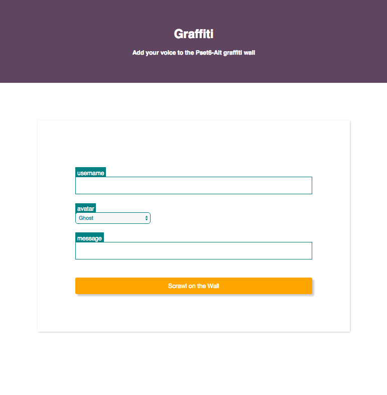
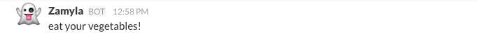

##### [Module 6](../../../)

# Problem Set 6 (Alternative)

This assignment is gong to be very similar to the [LunchCode]() studio. You will create an HTML page with a form that allows the user to interact with an API.

This time we will use the API to Slack, a chatroom service. By filling out the form, users will be able to post messages to a group conversation.

### Slack

Slack, if you're not familiar, is a chatroom service. The easiest way to see is to check it out! 

Help them join LaunchCode Community or another team.

type something in the channel

### Graffiti

Slack has a vast API for doing all kinds of fancy cool stuff. We're going to use one particular feature, their <a>Incoming Web Hooks</a>, which simply allows external programs to post messages to a channel. For example, you might 

Go take a look at the <a>#GraffitiWall</a> channel, which we have set up specifically for the assignment. The idea is that this channel is just a big shared "graffiti wall" on which hundreds of CS50xers can come together and share pearls of wisdom such as:

* "Testing 123..."
* "asdf"
* "malan wuz hear"
* "Why is this not working?"
* "omg jk it actually worked lol"
* "malan RULEZ!"

It's gonna be wild.

Go to Vocareum to get the key

Try posting with the curl request and see the result.

### Your Mission

Your job is to create an HTML page with a form that will post messages to the #GraffitWall channel. Your page should look something like this:

When the user clicks the orange "Tag the Wall" button, the form should submit a "POST" request to the Slack API, and receive a response like this:

That's not super interesting, but back in our channel, we should now see this:

### Starter code

talk about the JS

### Select

talk about `<select>`

### Debugging

If you're having trouble, the developer tools are a nice place to do some debugging. 

Show network tabs screenshots

### Adding Styles

css joke gif

http://www.w3schools.com/css/css_form.asp

google stuff

### How to Submit

### 

***

TODO

Something involving cURL and HTML!

Should reinforce the material covered in the 
<a href="../../class1-prep" target="_blank">prep</a>
<a href="../../class2-prep" target="_blank">work</a>.

Should require 5+ hours of work for most students.

## The Notes for the cURL part

#### The Workflow

The flow for the curl part of the PSET should be this:

1. Intro the part of the HTTP protocol that we want to talk about
2. Translate that to curl invocation
3. Execute the command, and have students look at stdout from terminal and from browser

#### The Activities

I have a couple of suggestions of possible APIs to interact with, here are a few:

- [SWAPI](swapi.co) GET only, no auth
- [GitHub](https://developer.github.com/v3/)
- [WikiMedia](https://en.wikipedia.org/w/api.php)
- Google Search
- Slack??
- Twitter??

Because we are going to focus on HTML and CSS in this PSET, I suggest that we focus on
the services that return HTML instead of JSON. 
