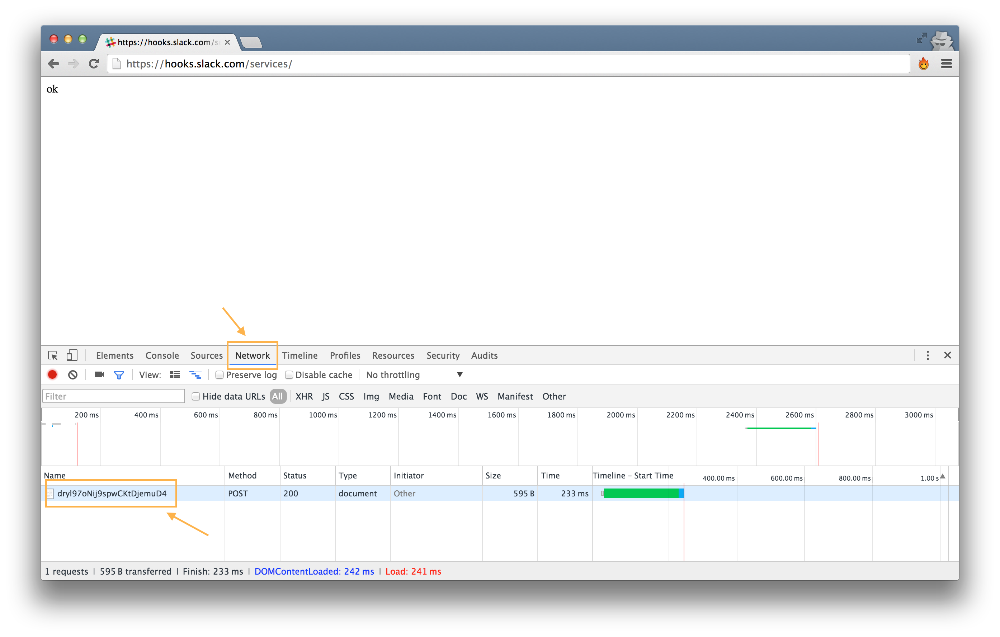
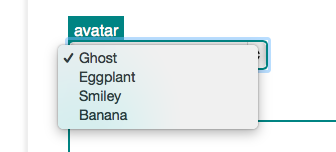

##### [Module 6](../../../)

# Problem Set 6 (Alternative)

This problem set is going to be very similar to the [LunchCode]() studio. You will create an HTML page with a form that allows the user to interact with an API.

This time we will use the API to <a href="https://slack.com" target="_blank">Slack</a>, a chatroom service. By filling out the form, users will be able to post messages to a group conversation.

### Slack

Slack, if you're not familiar, is a chatroom service designed for teams of people to communicate on group projects. The easiest way to see is to check it out! 

We have a slack team called LaunchCode Community which you should totally should have joined already! But if not, <a href="https://launchcode-community.herokuapp.com" target="_blank">click here</a> to get the invite.

Once you have created an account and signed in, you should see a chatroom with some messages posted, and a box at the bottom to post your own message. You've been dropped into the `#general` channel, but there are other channels for more specific topics (each channel is its own chatroom). Click the `Channels` link in the left-hand menu to see a list of all our channels. Scroll down and find the `#cs50-general` channel and try that one (or just <a href="https://launchcodecommunity.slack.com/messages/cs50-general/" target="_blank">click here</a> if you got lost there). In this channel you'll find friendly folks talking about CS50x and helping each other, lovely stuff like that. Click the `Join Channel` button. Now you can post here too. If you're feeling not-shy, go ahead and say hello!

### Graffiti

Slack has a vast API for doing all kinds of fancy cool stuff. We're going to use one particular feature, their <a>Incoming Web Hooks</a>, which simply allows external programs to post messages to a channel. For example, you might 

Go take a look at the <a href="https://launchcodecommunity.slack.com/messages/pset6-graffitiwall/" target="_blank">#pset6-graffitiwall</a> channel, which we have set up specifically for the assignment. This channel will serve as a big shared "graffiti wall" on which you and hundreds of other CS50xers will come together and share pearls of wisdom such as:

* "Testing 123..."
* "asdf"
* "malan wuz hear"
* "Why is this not working?"
* "omg it actually worked jk lol"
* "malan rulez!"

It's gonna be wild.

### The Slack API

Let's take a few minutes to get comfortable with this API.

Go to Vocareum to get the key

Try posting with the curl request and see the result.

### Your Mission

Your job is to create an HTML page with a form that will post messages to the `#pset6-graffitiwall` channel. Your page should look something like this:

When the user clicks the orange "Scrawl on the Wall" button, the form should submit a "POST" request to the Slack API, and receive a response like this:

That's not super interesting, but over in our #pset6-graffitiwall channel on Slack, we should now see this:

### Starter code

We have given you some starter code in <a href="graffiti.html" target="_blank">graffiti.html</a>. Copy this code into a new file in your IDE, and take a look.

Up in the `<head>`, we have a `<title>`, followed by a `<link>` to a css stylesheet, which we have also gotten started for you in <a href="styles.html" target="_blank">styles.css</a>.

Next, in the `<body>`, we have a `
` with the page heading and tagline. Below that is the heart of the matter, another `
` inside of which is the `<form>` where all the action will happen. Currently there is nothing inside the form -- that's where you come in!

### Javascript

But first, notice that last thing in our page is a handful of `<script>` tags. These will allow us to run a bit of Javascript code when our page loads.

So what's the deal with the Javascript? Javascript is a programming language that can be executed inside a browser. Javascript is executed by inserting a `<script>` tag in an HTML page, as you can you see here. You will learn much more about Javascript in Module 8, and if you go on to do more web development work, especially on the front-end, you will spend lots of time writing JS. 

Of course you have not yet learned it yet, so we have provided you with all of the necessary code, which is right there at the bottom of the `graffiti.html` file. Don't worry about trying to understand it line by line, but let's briefly go over what the script does and why we need it in the first place.

The script here performs one very crucial task. Our overall goal in this project is send over to Slack an HTTP request containing a few pieces of information, like the name of the channel we want to post to, the username of the poster, and the text content of their message. But recall that the *format* in which the API is expecting to receive that information is very particular. Namely, Slack is expecting an HTTP request with just *one* additional field, called "payload", *inside of which* are the key value pairs describing the information above. 

This is not what an HTML form, left to its own devices, is going to give us. The form wants to create a *separate* field for each of its `<input>` elements. So our script's job is to remedy the situation by converting from one format to the other. It does so by establishing a function that will be called as soon as the form's submit button is clicked. That function will be executed right before the request is sent out. What the function does is, it combs through each of the `<input>` elements in the form and collects their data, and compiles all that data into a JSON string. Finally, it inserts into the form a *new* `<input>` whose `name` is `"payload"` and whose `value` is that JSON string. Now, when the request is sent, it will contain the "payload" field that Slack is looking for.

Phew! That was a mouthful. The key takeaway is that an HTML form on its own would not have sent our data in a format that Slack understands, but thanks to this additonal bit of javascript code, you can now write your form in the same style as any other form, including the one you did back in the Studio.

### The Essentials

Ok, time to get to it! 

As always, you should first try to accomplish the most stripped-down, barebones task possible, and then move on to adding additional fanciness in small increments. 

With that in mind, your first task is to scrawl a basic rudimentary message on the wall. Recall that there are only two pieces of info that Slack absolutely requires: 

* the name of the channel
* the text of the message

So your first step is to get those bits of data into your request. Additionally, as always, you'll need the url for the host and endpoint, and the method type (do you think we want "GET" or "POST" here?)

### Debugging

If you're having trouble, the developer tools are a nice place to do some debugging. 

In Chrome, the `Network` tab allows you to inspect HTTP requests and responses coming in and out. That sounds useful! 

### Select

Once you've got the basics working, you can add some more stuff. 

The "low hanging fruit" here is the `username` field. Once you've made it this far, you should know the drill for how to add that.

After the username, we also want the user to be able to choose an avatar image. Slack will let us 

In our mockup image, you might have noticed that we use a little dropdown widget:

How do you make one of those? Introducing another new HTML tag, the `<select>`. Check out <a href="http://www.w3schools.com/tags/tag_select.asp" target="_blank">W3 Schools / Select</a> for an example. 

### CSS

Once you've got all the functionality working, time to make it shine!

The styling on this mockup is a bit more challenging than the assignments you've done so far, and we maybe sorta used some CSS properties you haven't learned about yet. So we're throwing you into the deep end and letting you  here. But that's probably the best way to learn CSS. You say, how do I change the border color? Then you google "css border color" and figure it out.

A great place to start is this article: <a href="http://www.w3schools.com/css/css_form.asp">W3 Schools / CSS Forms</a>.

After you match the mockup, feel free to get creative and style your page however you like!

Good luck! CSS can be <a href="http://imgur.com/gallery/Q3cUg29" target="_blank">frustrating</a>, but can also be loads of fun.

### How to Submit

***

### Old Notes:

Something involving cURL and HTML!

Should reinforce the material covered in the 
<a href="../../class1-prep" target="_blank">prep</a>
<a href="../../class2-prep" target="_blank">work</a>.

Should require 5+ hours of work for most students.

## The Notes for the cURL part

#### The Workflow

The flow for the curl part of the PSET should be this:

1. Intro the part of the HTTP protocol that we want to talk about
2. Translate that to curl invocation
3. Execute the command, and have students look at stdout from terminal and from browser

#### The Activities

I have a couple of suggestions of possible APIs to interact with, here are a few:

- [SWAPI](swapi.co) GET only, no auth
- [GitHub](https://developer.github.com/v3/)
- [WikiMedia](https://en.wikipedia.org/w/api.php)
- Google Search
- Slack??
- Twitter??

Because we are going to focus on HTML and CSS in this PSET, I suggest that we focus on
the services that return HTML instead of JSON. 
