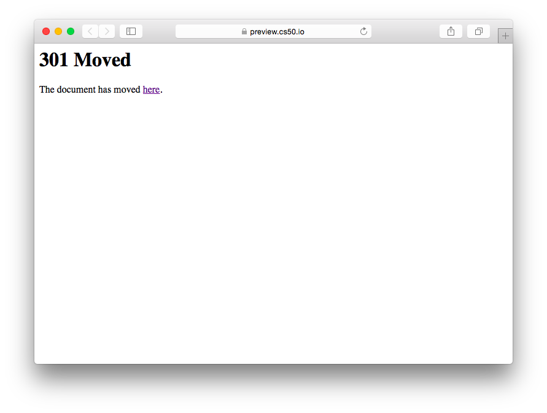

##### Module 6 
[Back to Class 1 Prep](../../class1-prep)

# Follow Along: cURL

There's a really cool program called `cURL` that allows us to make HTTP requests on the command line. Follow along with me (you can pretend I'm David Malan) as we use curl to practice speaking HTTP-ese with the machines.

In your IDE, make a directory as usual, at `module6/followalongs/curl/`, and then navigate to that spot in your terminal window.

Then type the following into the terminal:

```nohighlight
$ curl google.com
```

You should see the following response:

```nohighlight
$ curl google.com
<HTML><HEAD><meta http-equiv="content-type" content="text/html;charset=utf-8">
<TITLE>301 Moved</TITLE></HEAD><BODY>
<H1>301 Moved</H1>
The document has moved
<A HREF="http://www.google.com/">here</A>.
</BODY></HTML>
```

Cool! We just sent an HTTP request to Google, and got back some HTML from them.

Using the `-v` option will allow us to see the HTTP headers that were passed back and forth. Run the same command again with `-v` inserted:

```nohighlight
$ curl -v google.com                                                                               
```

and you should see a response like this:

```nohighlight
* Rebuilt URL to: google.com/
* Hostname was NOT found in DNS cache
*   Trying 209.85.146.113...
* Connected to google.com (209.85.146.113) port 80 (#0)
> GET / HTTP/1.1
> User-Agent: curl/7.35.0
> Host: google.com
> Accept: */*
> 
< HTTP/1.1 301 Moved Permanently
< Location: http://www.google.com/
< Content-Type: text/html; charset=UTF-8
< Date: Mon, 29 Feb 2016 17:42:30 GMT
< Expires: Wed, 30 Mar 2016 17:42:30 GMT
< Cache-Control: public, max-age=2592000
* Server gws is not blacklisted
< Server: gws
< Content-Length: 219
< X-XSS-Protection: 1; mode=block
< X-Frame-Options: SAMEORIGIN
< 
<HTML><HEAD><meta http-equiv="content-type" content="text/html;charset=utf-8">
<TITLE>301 Moved</TITLE></HEAD><BODY>
<H1>301 Moved</H1>
The document has moved
<A HREF="http://www.google.com/">here</A>.
</BODY></HTML>
* Connection #0 to host google.com left intact
```

Above, we can see the HTTP *request* that we sent, and the *response* that we received back. 

The request was:

```nohighlight
> GET / HTTP/1.1
> User-Agent: curl/7.35.0
> Host: google.com
> Accept: */*
```

We made a `GET` request to `/` (the root page) of the host `google.com` using `HTTP` version `1.1`, via `curl`, and we said that we were able to accept a response in any format.

The remainder of what is shown is the response we received back. 

The response is broken into two parts: the headers, and the body. You can think of the response as an envelope with a letter inside. The headers are various pieces of "meta-data", the stuff you would write on the outside of the envelope, and the body is the actual letter itself.

For now we can ignore most of the headers we received, but let's take a look at the first two lines:
```nohighlight
< HTTP/1.1 301 Moved Permanently
< Location: http://www.google.com/
```

As you can see, we received a response code of `301`, representing `Moved Permanently`. Essentially, we were told that the host `http://google.com` does not actually exist-- the *real* location is the one with the `www` subdomain, `http://www.google.com`. A 301 reponse just means: the host you are looking for has been moved permanently to this other location.

In the response's body, the HTML we received is similary meant to inform a person that Google's site is actually somewhere else. 

```html
<HTML><HEAD><meta http-equiv="content-type" content="text/html;charset=utf-8">
<TITLE>301 Moved</TITLE></HEAD><BODY>
<H1>301 Moved</H1>
The document has moved
<A HREF="http://www.google.com/">here</A>.
</BODY></HTML>
```

You will learn all about HTML starting next class, but for now, suffice it to say that an internet browser like Chrome or Firefox would be able to interpret the code above and render a page onto the window like this:



where that "[here](http://www.google.com)" link points to `http://www.google.com`.

Of course, if you actually open up a browser window and visit `google.com` without the `www`, you never see this ugly 301 page. You end up directly at the normal google homepage! But it turns out that under the hood, your browser actually *did* receive that same `301` response. The reason you don't see anything is because a typical browser, upon receiving the `301`, will neglect to display that HTML, and instead will simply redirect you automatically to the new location specifed in the location header (`Location: http://www.google.com/`).

Let's try making another curl request. This time, we'll connect to the "real" google:

```nohighlight
$ curl -v www.google.com/
```

If you run the above command, and all goes well, you should see an ungodly barrage of incomprehensible text. You'll have to scroll up a little bit just to find the place where you originally made the command. But when you find it, you should see the familiar request and response headers. Your response headers should look something like this:

```nohighlight
< HTTP/1.1 200 OK
< Date: Mon, 29 Feb 2016 19:52:50 GMT
< Expires: -1
< Cache-Control: private, max-age=0
< Content-Type: text/html; charset=ISO-8859-1
< P3P: CP="This is not a P3P policy! See https://www.google.com/support/accounts/answer/151657?hl=en for more info."
* Server gws is not blacklisted
< Server: gws
< X-XSS-Protection: 1; mode=block
< X-Frame-Options: SAMEORIGIN
< Set-Cookie: NID=77=ZBRzfm8GIePi1KdttsWQc0ztxeFoLvyeBE0AMN8HS__QF4ejpccfRSpSRRkuvKaD3qlG6HIJGhDkBgjAAfBQkVxi4T97gpN5a8G_ldCtepgBT5F_xr68Zigy6fIWfiympwVubvo2-F7WR48; expires=Tue, 30-Aug-2016 19:52:50 GMT; path=/; domain=.google.com; HttpOnly
< Accept-Ranges: none
< Vary: Accept-Encoding
< Transfer-Encoding: chunked
```

From the first line, `HTTP/1.1 200 OK` we can see that this time we got back a `200 OK` response code, indicating that everything is peachy. 

Below the headers are the Great Wall of Text, which, in fact, perfectly valid HTML, namely the HTML that describes google's homepage!

Let's verify this for ourselves. Using the `-o` option, we can tell cURL to pipe its output into a file for us. We want to  pipe the output into an HTML file called, say, `google.html`. Run the following:

```nohighlight
$ curl -v -o google.html www.google.com/
```

And now, you should see that `google.html` file in your file tree on the lefthand sidebar of the IDE. If you open it up you'll see the same jumble of text. But if you right-click on that file, and select preview, the IDE will show you a preview of what the page looks like. Lo and behold, we see google! (More or less. Some of the images may have failed to load, and the page is not "styled" nicely.)


