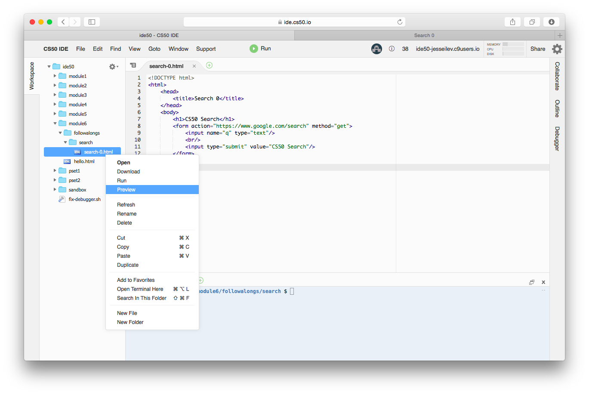
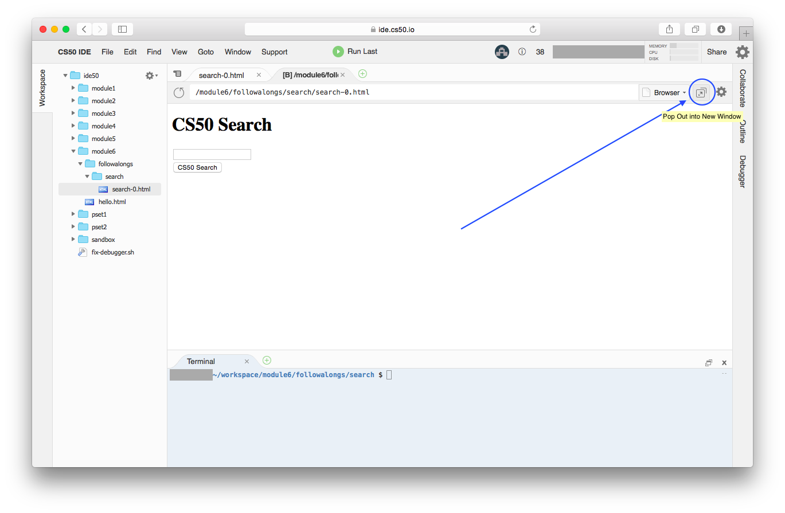

##### Module 6

[Back to Class 2 Prep](../../class2-prep)

# Resource: The IDE Browser

Some of the Walkthrough videos are from an older era of CS50 before the IDE existed, so you won't do things the exact same way.

For example, in <a>search</>, the way in which David opens his HTML file is different from what we will do. 

When you want to preview an HTML file in the IDE, here's what to do:

1. Right-click on the file and choose "Preview"
  

2. This opens up a preview of your page in a new tab in your IDE. But some features, such as the search we are trying to execute here, will not work until we leave the IDE entirely. To get a new browser window, click "Pop Out into New Window"
  

3. Now you have a new tab in your browser (totally outside the IDE) which contains your web page!
  
