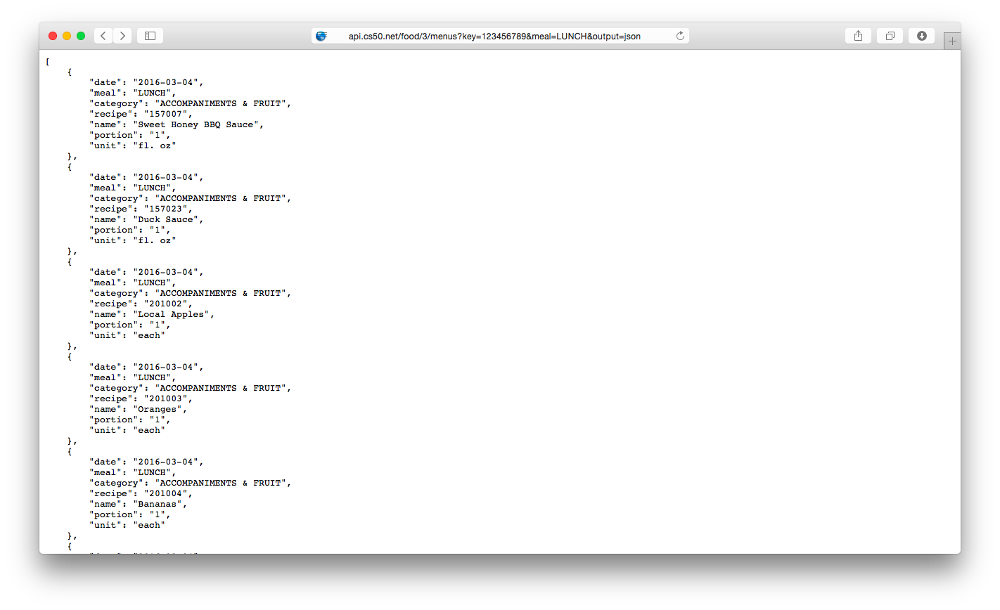

##### Module 6 

[Back to Class 2](../../class2)
 
# Studio: LunchCode

Today we are going to be working once again with CS50's API, specifically the Food API. Your assignment for today is to build a front end page for users to query the API. 

In the previous studio, you used a page from the cs50 docs:


Today your job is to build a very similar page. Here is a mockup:


As you can see, our page contains three `<form>` elements, one for each of the three "endpoints" of the food API: `/facts`, `/menus`, and `/recipes`.

Upon filling out one of the forms and clicking its `SEND REQUEST` button, a user should be whisked away to the page displaying the response from the API, like this:



(The url in the screenshot above is: http://api.cs50.net/food/3/menus?key=123456789&output=json&meal=LUNCH)

### Getting Started

We've given you a little starter code in <a href="lunchcode.html" target="_blank">lunchcode.html</a>. Click that link, and you should see, in a new browser tab, a very plain form that says "Menus". 

OK, so that's what the page looks like, but where is the actual starter code?? Well, here's the thing: we sent you a link to an HTML file, so your browser went ahead and did what it always does when opening an HTML file: it rendered the page! 

But no matter, this is a good opportunity to remind you that you can always view the *source* code for any HTML page by <a href="http://cdn.cs50.net/2015/fall/lectures/7/m/notes7m/notes7m.html#html" target="_blank">using your browser's developer tools</a>.

Go ahead and copy the source over into a new file in your IDE.

### Action

You may have noticed that the form currently does not *go* anywhere. Clicking on the `SEND REQUEST` button simply causes the page to refresh. Your first step is to fix that. You want users to be taken to somewhere upon submitting the form. Where they should go, and how to implement that feature, we will leave for you to figure out! For a refresher on form submission, see the <a href="http://cdn.cs50.net/2015/fall/lectures/7/m/src7m/search-0.html.src" target="_blank">search-0 source code<a> from the <a href="https://www.youtube.com/watch?v=RQ2_TIXBo00&list=PLhQjrBD2T381f7IlC090UL9JN-PJfGoLd&index=14" target="_blank">Walkthrough video</a> in which David wrote a front-end to Google's search service. 

### Authentication

After you implement the form so that submission takes the user to the Food API, you will presumably run into an error message about "authentication parameters missing". You probably remember from last studio that the solution to this was to include your personal API key as a parameter in the url:

```
...&key=123456789...
```

where `123456789` is your API key. We can do the same thing here by including another `<input>` field in the form, like this:

```html
<input type="text" name="key" value="123456789"/>
```

If you add that `<input>` element, you should now find that your form takes you to the promised land of menus data.

### Hidden Inputs

*But wait!* you say, *The mockup above we are trying to copy does not have any extra field for the API key. The mockup contains only one field for `meal:`! How did this mockup function properly without that extra field? Is this a giant hoax? Conspiracy?* 

Great question (although you may have gotten carried away at the end, there). It turns out that our mockup *does*  have an input element like the one above-- you just don't see it. There is a special type of input available for precisely this purpose: when you want to include an HTTP parameter to your form's submission url, but you don't actually need the user to see anything or tell you anything. This type is called the `"hidden"` :

```html
<input type="hidden" ... />
```

Try changing the `type` from `"text"` to `"hidden"`, and you should see the input field disappear from the screen, but still work its magic in the sumbission url.

### The Other Forms

### The Page Heading

### Styles

