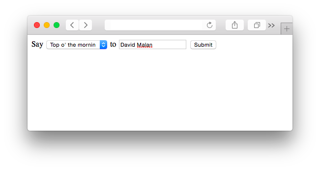
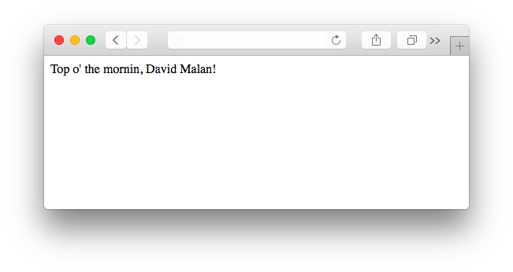

##### Module 7

[Back to Class 1 Prep](../class1-prep)

# Exercise: Hello 0

### Starter Code

This exercises has some starter code. Copy over these two files into your IDE: [hello-form.php](./hello-form.html) and [hello-response.php](./hello-response.html).

We've given you the front end and back end to very basic Hello World website, which simply asks the user for their name and then says hello to that person.

Let's take a look at what we have so far. Start up a server in your current directory:

```nohighlight
apache50 start ./
```

Now visit `ide50-jharvard.cs50.io/hello-form.php` in a web browser.  You should see a page with a basic HTML form that reads "Say hello to _____". When you fill in the blank with a name (let's say "Zamyla") and submit the form, you should arrive at a different page, `hello-response.php`, which says "Hello, Zamyla!"

### Assignment

Your job is to add a new feature to this site: Create an additional form field that allows the user to customize the "Hello" part of the message to some other sort of greeting, like "Hi" or "Hola". One nice option would be to use a `<select>` tag, as pictured in the mockup below:



Submitting the form should yield the appropriate response, as pictured here:


