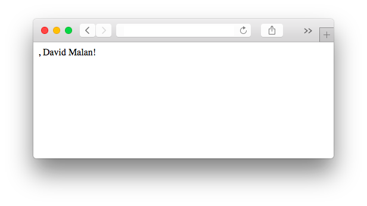

##### Module 7

[Back to Class 1 Prep](../class1-prep)

# Exercise: Hello 1

Let's build off our previous exercise by adding server-side validation, just like David Malan did in the <a href="https://www.youtube.com/watch?v=blwsjq0lQb4&index=5&list=PLhQjrBD2T381f7IlC090UL9JN-PJfGoLd" target="_blank">fromshims-1</a> walkthrough. 

### Starter Code

In [hello-form.php](./hello-form.html) and [hello-response.php](./hello-response.html), you will find a website that picks up more or less where we left off last time.

Upon visiting `hello-form.php`, the user is presented with a form with a dropdown menu of "greetings" to choose from, and a text field to type their name. Upon form submission, the user is taken to `hello-response.php`, which greets them according to the name they provided.

### Assignment

In `hello-response.php`, you'll notice we left you three TODOs. 

For one thing, we neglected to actually utilize the "greeting" option that the user chose. Our site still says "Hello" regardless of which option they selected. You can fix this the same way you did back in the [Hello 0](../hello0) exercise.

That takes care of 2 of the TODOs. One left!

The new feature on this exercise is that our site also does some validation on the back end. If the user failed to type in their name, our response script will automatically redirect them back to the form page. But! We neglected to make sure that the greeting was also provided. If you visit the page currently, and type a name but abstain from selecting a greeting, you'll see a response like this:

That's no good. Go ahead and fix it!
