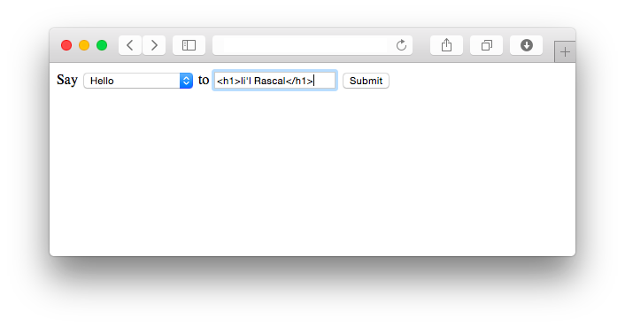
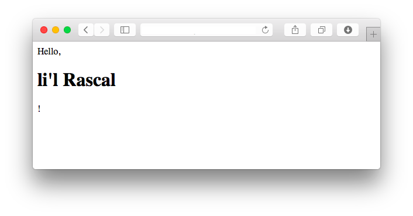

##### Module 7
[Back to Class 1 Prep](../../class1-prep)

# Resource: htmlspecialchars

Going back to our continuing Hello example, let's now introduce a little wrinkle.

Suppose we have a mischevious user who does types something like this:



You see what that rascal is doing? If we handle the form submission like this:

```php
<?php 

$greeting = $_GET["greeting"];
$username = $_GET["username"];
print("$greeting, {$username}!");

?>
```

The end result is going to be:



Uh oh!

Our browser sees that `"<h1>"` and gets all excited, misinterpretting it as an actual HTML tag, rather than simply treating it as part of the user's name, like it should.

PHP gives us a function called `htmlspecialchars` for situations like this. This function allows us to specify that a string should taken as a literal string, not as HTML.

In our script, let's pass the user input through the `htmlspecialchars` function before printing it:

```php
<?php 

$greeting = $_GET["greeting"];
$username = $_GET["username"];
$message = htmlspecialchars("$greeting, {$username}!");
print($message);

?>
```

When we do this, the `$message` variable actually now looks like this:

```php
"Hello, &lt;h1&gt;li'l Rascal!&lt;/h1&gt;"
```

which looks like gobbledygook to us, but the browser understands it to mean *OK, I should treat this '<' character as a literal '<' character and not try to interpret it as the beginning of a tag*, and so on, for each of the "special characters" that have a syntacic function in HTML.

Now our Rascal user sees this on his screen:


That's better!

The moral of this story is that any time you are trying to insert some content into your HTML, you should wrap it into a call to `htmlspecialchars()`, so that the browser interprets the content as it literally is, rather than misinterpretting it as HTML.

