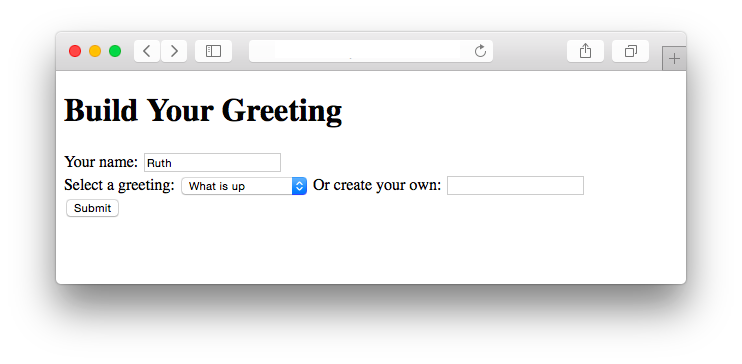
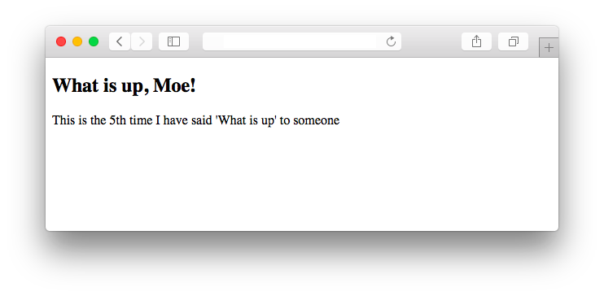
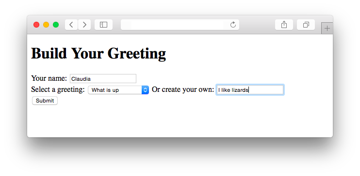
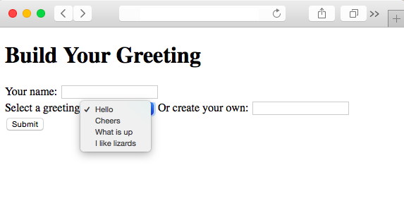

##### Module 7

[Back to Class 2](../../class2)

# Studio: Greetings

Today you will use your new SQL skills to build a full website with a PHP back end *and* a database that persists user data!

Your site will also follow good MVC conventions.

This is a big, hearty studio, with lots of work to do. Oh boy!

### The Goal

First, let's go over what you are trying to accomplish.

The home page is simply a form where users can input their name and choose a greeting (If you did the [Class 1 Prep](../../class1-prep), this should feel very familiar!):



Upon submitting the form, the user should be warmly greeted:


Notice that the site also reports how many times a particular greeting has been used. If someone else (named, say, Moe) were to come along and select "What is up" at this point, he should see this:



How does the site keep track of this? By using a database, of course! You will build a database table to store greetings, where each greeting will have a `text` field with a value like `"What is up"` and a `num_times` field with a value like `5`. More on that later.

Another feature to notice is that the form on the homepage should also give users the option of creating their own "custom" greeting, rather than choosing from one of the "pre-made" greetings in the drop-down menu:



Claudia should see a response like this:


(As you can see, your site doesn't have to be smart about English numbering syntax. You can say "1th" and "2th" instead of "1st" and "2nd").

One last thing to note is that when a user creates a custom greeting like "I like lizards", that new greeting should then be permanently added to the database, and subsequently should be available as an option in the dropdown menu:




### Starter Code

We have provided you with some starter code. Download it using the `wget` command:

```nohighlight
$ cd ~/workspace/module7/studios/
$ wget education.launchcode.org/calendar/cs50/unit3-web/module7/materials/studios/greetings/greetings.zip
```

Unzip the `.zip` archive, confirm that you now have a `greetings` directory, and then delete the archive:

```nohighlight
$ unzip greetings.zip
$ ls 
greetings/ greetings.zip mult_table/
$ rm -f greetings.zip
```

### A Brief Tour

Let's see what the project looks like so far.

```nohighlight
$ cd greetings
$ ls 
config.json includes/  public/  vendor/  views/
```

A lot of stuff in there! If we expand it, it looks like this:

``` nohighlight
├── config.json
├── public
    ├── greet.php
    └── index.php
├── views
    ├── greeting_form.php
    ├── greeting_display.php
    └── header.php
    ├── footer.php
├── includes
    └── helpers.php
└── vendor
    └── library50-php-5
        └── CS50
            ├── CS50.php
            └── (a bunch of other things we don't need to care about)
                ├── ... 
```

##### The `public/` Folder

The `public/` directory contains our Controllers, the pages that our site makes publicly available for users to visit. You should be pretty familiar by now with the following 2-page form/reponse dynamic:
* `index.php`, our "home page", displays a form where the user can submit her name and choose a greeting
* `greet.php` is the file that receives and handles the submission of the form.

##### The `views/` Folder

If you glance through the source code for the two public pages, `index.php` and `greet.php`, you might notice that neither contains any HTML. That's because, as per MVC, we want those Controller files to handle our core "business logic" only-- we do not want the Controllers to worry about the details of how stuff looks on screen. Any code specifying how stuff looks should be factored out into separate "template" View files, which our Controllers will simply combine together to assemble the overall response that ultimately gets sent back to the client. 

For example, notice that at the bottom of each of those Controller files is a section where we "render stuff", by passing the names of various template files to the the `render()` function from `helpers.php` (more on that soon). There are 4 such template files in the `views/` folder:
* `header.php` is some basic boilerplate HTML that goes at the top of a page
* `footer.php` is similar basic HTML for the bottom of a page
* `greeting_form.php` is the form that users fill out when they visit the home page
* `greeting_display.php` is the greeting that users see after submitting the form

Both Controllers follow a similar pattern of rendering the `header.php` and `footer.php` Views first and last respectively, with a more interesting piece of content sandwiched in between.

##### The `includes/` Folder

Over in the `includes/` folder is just one file, `helpers.php`, which contains a few helper functions:
* `render()`, as mentioned before, receives the name of a "template" file, and optionally some extra data that the template file will need. This function should check to see if the template file actually exists, and if so, render it by simply calling `require()` on it.
* `create_new_greeting()` receives a string representing a new custom greeting fom the user (e.g. "I like lizards"). It should add a new row to the database for that string, but only after checking to make sure the database does not *already* contain a greeting with identical text.

##### The `vendor/` folder

The `vendor` folder is where we have placed all 3rd-party code that other people wrote that we would like to use in our project. 

There is really only one 3rd-party library that we are using directly, and that is a small library written by the CS50 folks in a file called `CS50.php`. This CS50 library shields us from many of the low-level details involved in connecting to and interacting with a database, which will free us to focus on our SQL queries instead of the grunt work required to set up a connection, authenticate ourselves, and so on.

Incidentally, there are a bunch more libraries in this folder, because the CS50 library itself is dependent on them. But we don't have to care about that for the purposes of this project.

### Setting Up the Database

The first thing to do is to set up the database. Follow along as we walk you though how to do that. 

##### MySQL Server

First, start up your apache server:

```nohighlight
$ apache50 start public/
Setting Apache's document root to /home/ubuntu/workspace/module7/studios/greetings/public ...
 * Starting web server apache2
 * 
Apache started successfully!
Your site is now available at https://ide50-jharvard.c9users.io
```

Next, start up another separate server for the database:

```nohighlight
$ mysql50 start
 * Starting MySQL database server mysqld
   ...done.
 * Checking for tables which need an upgrade, are corrupt or were 
not closed cleanly.
```

This server establishes a communication channel between our back end and our database, so that we can read from and write to the database.

But we don't yet have a database! Let's create one.

##### Create the Database in phpMyAdmin

If you head over `https://ide50-jharvard.cs50.io` (with your username instead of "jharvard"), you will see a big orange error on the screen. No problem, this is just because you don't have a database yet. Go to the address bar and add `/phpmyadmin` onto the end of your url, yielding `https://ide50-jharvard.cs50.io/phpmyadmin`, and hit Enter.

You should now arrive at a login screen for something called phpMyAdmin. phpMyAdmin is a tool that allows you to manage your MySQL databases. Let's log in. You can find your username and password by running some magic commands in the terminal:

```nohighlight
$ username50 
jharvard
$ password50
123456789
```

Once you log in, click on the `SQL` tab in the menu at the top (towards the left). This tool allows you to write SQL code to create and edit databases.

Paste the following code into the textbox:

```SQL
--
-- Database: `module7studio`
--

CREATE DATABASE IF NOT EXISTS module7studio;
USE module7studio;

-- --------------------------------------------------------

--
-- Create a table `greetings`
--

CREATE TABLE IF NOT EXISTS `greetings` (
  id int(10) unsigned NOT NULL AUTO_INCREMENT,
  text varchar(255) NOT NULL,
  num_times int(10) unsigned NOT NULL,
  PRIMARY KEY (id),
  UNIQUE KEY text (text)
) ENGINE=InnoDB;

--
-- Add some data to table `greetings`
--

INSERT INTO greetings (text) VALUES('Hello');
INSERT INTO greetings (text) VALUES('Cheers');
INSERT INTO greetings (text) VALUES('What is up');
```

Essentially, we are creating a new database called `module7studio`, within which we are creating a new table called `greetings`, and finally we are adding a few rows to the `greetings` table. 

Look over the code for a sec, make sure it makes sense, and then execute the code by clicking Go at the bottom right.

You should now be able to click on a table called `greetings`, which you can browse and see that it contains some data, the three rows we inserted!

##### Add Authenticaion to config.json

There is one file we didn't talk about previously, `config.json`. Open it up now, and you'll see it is a very small chunk of JSON, with some TODOs. This is simply a place where we put our MySQL credentials, which the CS50 library will use in order to establish its connection to the MySQL server. 

Go ahead and add your username and password to this file, and save it.

### Check It Out

Now we are finally at the point where you can visit the site!

Go back to the root page, `https://ide50-jharvard.cs50.io`. You should now see a log statement detailing the contents of the database. Indeed, we are looking at the output of `index.php`. (Recall that even though we aren't directly visiting `/index.php` in the URL, the apache server, upon finding a file with the special name `"index"`, automatically takes the user there.) 

##### The `var_dump()` function

Look at the source code for `index.php`, and you will see that the output on the page is coming from two lines near the top of the file:

```php
print("This is what we have in the database right now:");
var_dump($greeting_rows);
```

The second line uses an awesome php function valled `var_dump()` to render to the screen a nicely formatted, human-readable string describing the contents of our local `$greeting_rows` variable. Whenever you're trying to debug, make liberal use of the `var_dump()` function.

##### The `query()` function

Looking up, we can see that the `$greeting_rows` variable came from this line:

```php
$greeting_rows = CS50::query("SELECT * FROM greetings");
```

This is where the magic happens. The CS50 library exposes a function called `query()` which allows you to make SQL queries on your database. You simply pass in a string with the SQL code, and the function will execute the query and return the results. For more one this function, see the <a href="http://cdn.cs50.net/2015/fall/lectures/8/w/notes8w/notes8w.html#sql" target="_blank">lecture notes from Week 8 / SQL</a>.

(Don't worry too much about the `CS50::` syntax. The `query()` function is "inside of" an "object" or "class" called `CS50`, and so any time you want to use the function, you have to prepend `CS50::`.)

### Get to Work

After `index.php` gets the current data from the deatabase and dumps it to the screen, the next few lines call the `render()` function. But on screen, nothing seems to be showing up!

That's because `render()` is incomplete. That is your first task! Fill in the TODOs so that `render()` actually causes templates to show up on screen. You might find David Malan's `mvc-3` program provides a helpful example from which you can more-or-less copy. (See the <a href="http://cdn.cs50.net/2015/fall/lectures/8/m/src8m/mvc/3/helpers.php.src" target="_blank">source code</a> and the <a href="https://www.youtube.com/watch?v=5juddGp7D9g&index=5&list=PLhQjrBD2T3810Z6sRJdj148H0ANU2jJcO" target="_blank">walkthrough video</a> for guidance).

### Other TODOs

Once you get `render()` up and running, you should see a `<form>` on the screen! At that point, your next few TODOs will become apparent. Keep on working your way through all the TODOs (everything that needs to be done is documented in the source files) until your site contains all the features described above.

### How to Submit

Compress your `greetings` directory into a `.zip` file:

```nohighlight
cd ~/workspace/module7/studios
zip greetings.zip greetings
```

Upload `greetings.zip` on Vocareum, in the assignment titled **Studio: Greetings**.


