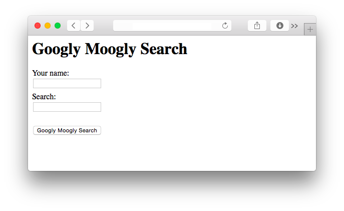
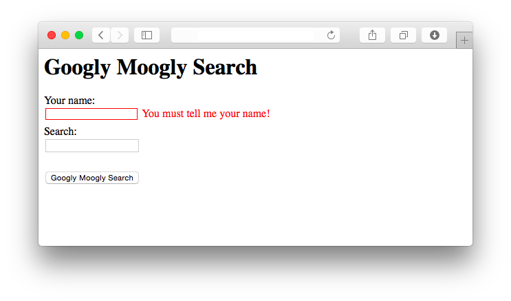
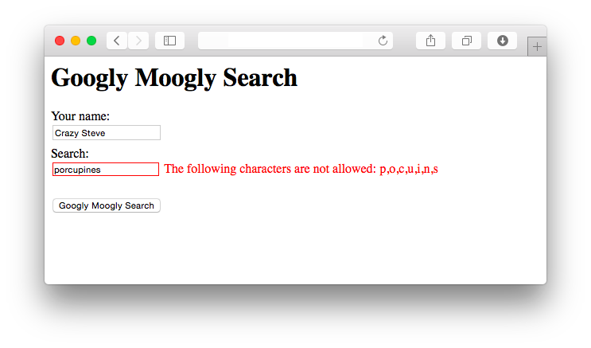

##### Module 8

[Back to Class 1](../../class1)

# Studio: Googly Moogly

Today you will get some practice using JavaScript to manipulate the DOM. Your JS script will perform client-side validation on an HTML form, kind of like this <a href="https://www.youtube.com/watch?v=r2iaKDH79oQ&index=8&list=PLhQjrBD2T382FjybRNOXyEdsjP9CNKJgb" target="_blank">Walkthrough</a>, but instead of reporting feedback with an annoying `alert()` message, you will provide a nice user experience by modifying the HTML content to include a helpful annotation on whichever field(s) the user messed up.

### The Goal

You have a brilliant idea for a new search engine, the Googly Moogly. It's kinda like Google, but better. With Googly Moogly, users are only allowed to search for things using letters from their own name. 

Your patent lawyer is drafting the paperwork as we speak, but in the mean time, let's build this thing. It should look like this:



If the user tries to submit the form without typing anything in at all, you should yell at them for failing to provide their name:



If they do provide a name, then they are free to submit the form... provided, of course, that their search query matches the Golden Googly Moogly Rule. 



Crazy Steve got rejected because his search term contained characters that were not part of his name. Notice also that you should inform the user about which specific characters were not allowed.

Now let's say Crazy Steve tries this:


What's wrong with "raves"? It says "s" is not allowed, but "Steve" starts with "S", so what's the problem? Well, turns out the Googly Moogly is a case-sensitive beast (Don't you remember? This whole thing was your idea.). So uppercase "S" is allowed, but not lowercase "s". This should actually make it easier for you to implement.

When Steve finally gets it right, like this:


he should be whisked away to learn about raveS:


### Starter Code

Grab our starter code as follows:

```nohighlight
$ cd ~/workspace/module8/studios
$ wget http://education.launchcode.org/cs50x-stlouis/calendar/cs50/unit3-web/module8/materials/studios/googlymoogly/googlymoogly.zip
```

Then unzip the archive and delete it:

```nohighlight
$ unzip googlymoogly.zip
$ ls 
googlymoogly/ googlymoogly.zip
rm googlymoogly.zip
```

The contents of the directory look like this:

```nohighlight
$ cd googlymoogly
$ tree
.
├── css
│   └── styles.css
├── index.html
└── scripts
    └── validate.js
```

Nothing crazy here, just an `index.html` file, along with a stylesheet and a JS script.

We have already done `index.html` and `styles.css`. The only file you will need to work in is `validate.js`.

### A Brief Tour

Open up the files in your IDE and check out what we've got so far.

##### HTML

In `index.html` we have, of course, a page with a `<form>`. Inside the form are two fields:
* one for the user's name 
* and one for the "query", the term she wants to search for. 

Each of those fields really requires three components:
* an `<input>` where the user can type
* a `<label>` describing what this field is all about (e.g., "What's your name?")
* another `<label>` to provide feedback if the user screwed up (e.g., "You must tell me your name!")

Because these three tags are really subparts that make up a cohesive unit, we have wrapped them in a `<div>` tag that will serve as their "container". 

So the form is really composed of two `<div>`s, one for each field.

##### CSS

In `css/styles.css`, there isn't much, just a few styles to color things red:
* The `.feedback-error` class represents feedback `<label>`s that are reporting errors. Their text color is set to red
* The `.input-invalid` class represents `<input>`s that were filled out improperly. They have a red border around them.
* The `.container-field` class represents those "container" `<div>`s discussed above. The have a bit of margin underneath them to add a little separation between multiple fields.


##### JavaScript

`validate.js` is where you come in. We have some code there in place, but there are 6 `TODO`s left for you.

There are a lot of equally valid methods available for traversing and manipulating the DOM, but you will probably use the following properties and functions:

*For DOM Elements*
* `innerHTML`
* `className`
* `getElementById()` (watch out! capital I, lowercase d)
* `querySelector()`

*For Arrays and Strings*
* `length`
* `push()`
* `indexOf()`

So google those (or googlymoogle them!) as needed.

One more small thing to note. Recall that if the user types an invalid search term, you must inform the user of the invalid characters they used:


This is actually very easy to do in Javascript. Because JS is "weakly typed", you can concatonate an array onto a string, and it won't complain: it will simply convert the array into a comma-separated string automatically. For example:

```js
var favNums = [7, 16, 1000];
console.log("My favorite numbers are: " + favNums);
// --> My favorite numbers are: 7,16,1000
```

### How to Submit

Submit your `validate.js` file on Vocareum for the assignment titled **Studio: Googly Moogly**
