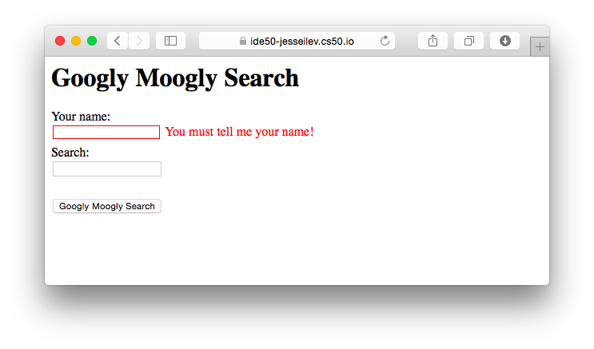

##### Module 8

[Back to Class 1](../../class1)

# Studio: Validate

Today you will get some practice using JavaScript to manipulate the DOM. Your JS script will perform client-side validation on an HTML form, kind of like these <a href="https://www.youtube.com/watch?v=eViManaIKkQ&index=9&list=PLhQjrBD2T382FjybRNOXyEdsjP9CNKJgb" target="_blank">Walkthroughs</a>, but instead of reporting feedback via an annoying `alert()` message, you will modify the HTML content to include a helpful annotation on whichever field(s) the user messed up.

### The Goal

TODO Googly themes

If the user tries to submit the form without typing anything in at all, you should yell at them for failing to provide their name:

If they do provide a name, then they are free to submit the form, but only if their search query matches Googly Moogly's Golden Rool. 

Crazy Steve got rejected because his search term contained characters that were not part of his name. Notice also that you should inform the user about which specific characters were not allowed.

Now let's say Crazy Steve tries this:

What's wrong with "raves"? Turns out Googly Moogly is a case-sensitive beast. So `"S"` is allowed, but not `"s"`. This should actually make it easier for you to implement. Thanks, Goog.

Finally, Steve gets it right:

and he is whisked away to learn about raveS:

