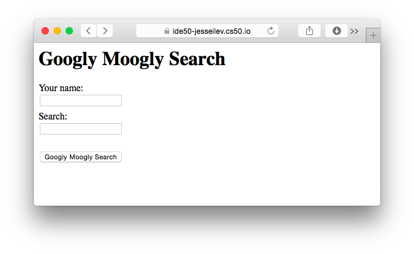
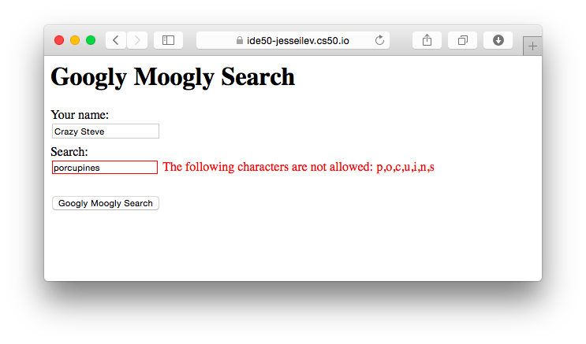
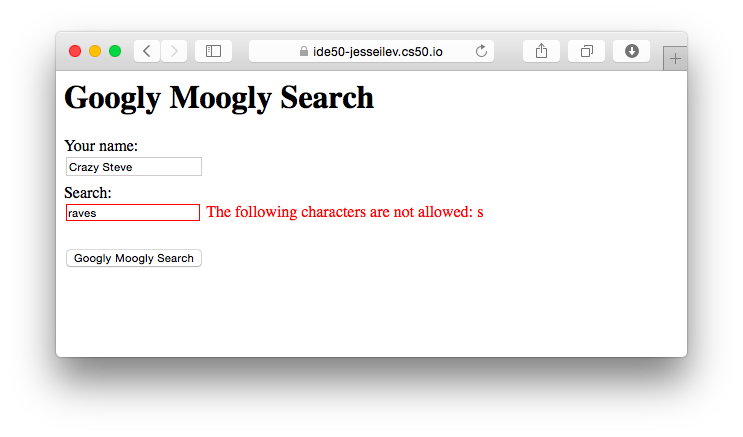
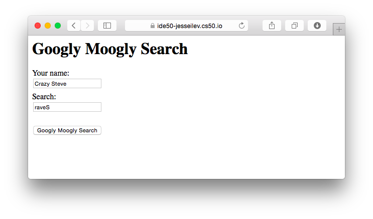

##### Module 8

[Back to Class 1](../../class1)

# Studio: Validate

Today you will get some practice using JavaScript to manipulate the DOM. Your JS script will perform client-side validation on an HTML form, kind of like these <a href="https://www.youtube.com/watch?v=eViManaIKkQ&index=9&list=PLhQjrBD2T382FjybRNOXyEdsjP9CNKJgb" target="_blank">Walkthroughs</a>, but instead of reporting feedback via an annoying `alert()` message, you will modify the HTML content to include a helpful annotation on whichever field(s) the user messed up.

### The Goal

